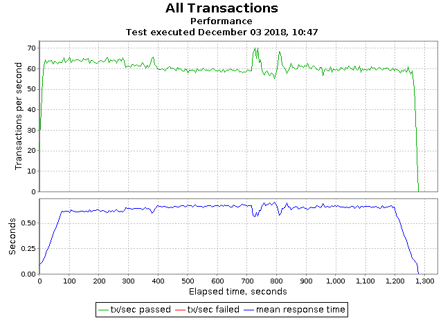

# Requirement
* Karaf 4.2.1
* Karaf-Cellar 4.1.2
* NGINX 1.12.2

# Install Karaf-Cellar

* first step: install karaf-cellar on karaf 4.2.1

````
root@karaf() > feature:repo-add cellar
root@karaf() > feature:install cellar
````

* second step: edit etc/hazelcast.xml file and inster your cluster IP

````
<join>
	<multicast enabled="false">
		<multicast-group>224.2.2.3</multicast-group>
		<multicast-port>54327</multicast-port>
	</multicast>
	<tcp-ip enabled="true">
		<interface>10.12.47.126</interface>
		<interface>10.12.47.117</interface>
		<interface>10.12.47.118</interface>
		<interface>10.12.47.119</interface>
		<interface>10.12.47.120</interface>
		<interface>10.12.47.121</interface>
		<interface>10.12.47.122</interface>
		<interface>10.12.47.123</interface>
		<interface>10.12.47.124</interface>
	</tcp-ip>
	
	...
	
</join>
````

* third step: modify server firewall, this step is depended to operation system. if you using linux redhat base like centOS or debian base like ubuntu follow these seteps
	* Redhate (CentOS)
	
		`$ firewall-cmd --zone=public --add-port=5701/tcp --permanent`
		
	* Debian (Ubuntu)
	
		`$ ufw allow 5701`
		
# Install NGINX

According to your operation system this step can be different

* CentOS: `$ yum install nginx`

* Ubuntu: `$ apt-get install nginx`

## Defination Nodes on NGINX

`$ cd /etc/nginx/`

`$ nano nginx.conf`

````
upstream mcb_application {
	ip_hash;
	server 10.12.47.126:8181;
	server 10.12.47.117:8181;
	server 10.12.47.118:8181;
	server 10.12.47.119:8181;
	server 10.12.47.120:8181;
	server 10.12.47.121:8181;
	server 10.12.47.122:8181;
	server 10.12.47.123:8181;
	server 10.12.47.124:8181;
}

server {
listen       80 default_server;
listen       [::]:80 default_server;

include /etc/nginx/default.d/*.conf;

location /mcb-webconsole {
	proxy_pass http://mcb_application;
}

location /service {
	proxy_pass http://mcb_application;
}

location /hawtio {
	proxy_pass http://mcb_application;
}

location /system {
	proxy_pass http://mcb_application;
}

error_page 404 /404.html;
	location = /40x.html {
}

error_page 500 502 503 504 /50x.html;
	location = /50x.html {
}

````

# Grinder

we used grinder technology for loading test.
* Edit grinder.properties
````
grinder.script = cluster.py
grinder.processes = 40
grinder.processIncrementInterval = 2000
grinder.duration = 1200000
````

## Result of testing


		
	
	
	
	
	
	